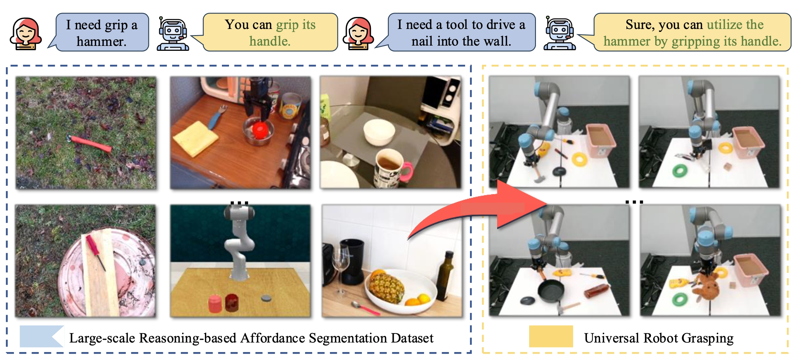

<div align="center">
<h1>
<b>
A Large-Scale Reasoning-based Affordance Segmentation Dataset and Model for Universal Robot Grasping
</b>
</h1>
</div>

<p align="center"></p>


> **[A Large-Scale Reasoning-based Affordance Segmentation Dataset and Model for Universal Robot Grasping]()**
>
> Dongming Wu, Yanping Fu, Saike Huang, Yingfei Liu, Fan Jia, Nian Liu, Feng Dai, Tiancai Wang, Rao Muhammad Anwer, Fahad Shahbaz Khan, Jianbing Shen

## TL;DR
- To push forward general robotic grasping, we introduce a large-scale reasoning-based affordance segmentation benchmark, **RAGNet**.  It contains 273k images, 180 categories, and 26k reasoning instructions. 
- Furthermore, we propose a comprehensive affordance-based grasping framework, named AffordanceNet, which consists of a VLM (named AffordanceVLM) pre-trained on our massive affordance data and a grasping network that conditions an affordance map to grasp the target.

## News
- [2025.07] Inference code and the [AffordanceVLM](https://huggingface.co/Dongming97/AffordanceVLM) model are released. Welcome to try it!
- [2025.07] The paper is released at [arXiv]().

## Getting Started

* [Installation](docs/installation.md)
* [Download dataset](docs/dataset.md)
* [Training and evaluation](docs/training_and_evaluation.md)

## Citation
If you find our work useful, please consider citing:

```bibtex
@article{wu2025ragnet,
  title={RAGNet: Large-scale Reasoning-based Affordance Segmentation Benchmark towards General Grasping},
  author={Wu, Dongming and Fu, Yanping and Huang, Saike and Liu, Yingfei and Jia, Fan and Liu, Nian and Dai, Feng and Wang, Tiancai and Anwer, Rao Muhammad and Khan, Fahad Shahbaz and Shen, Jianbing},
  year={2025}
}
```

## Acknowledgements
We thank the authors that open the following projects. 
- [LISA](https://github.com/dvlab-research/LISA)
- [LLaVA](https://github.com/haotian-liu/LLaVA) 
- [SAM](https://github.com/facebookresearch/segment-anything)