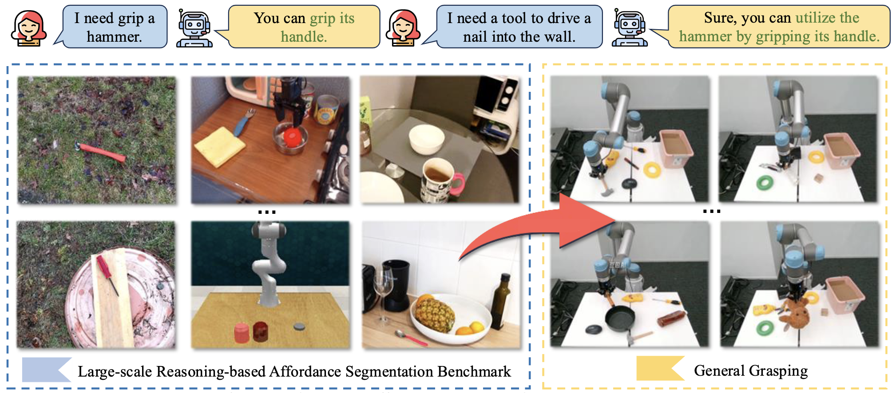

<div align="center">
<h1>
<b>
RAGNet: Large-scale Reasoning-based Affordance Segmentation Benchmark towards General Grasping
</b>
</h1>
</div>

<p align="center"></p>


> **[A Large-Scale Reasoning-based Affordance Segmentation Dataset and Model for Universal Robot Grasping]()**
>
> Dongming Wu, Yanping Fu, Saike Huang, Yingfei Liu, Fan Jia, Nian Liu, Feng Dai, Tiancai Wang, Rao Muhammad Anwer, Fahad Shahbaz Khan, Jianbing Shen

## TL;DR
- To push forward general robotic grasping, we introduce a large-scale reasoning-based affordance segmentation benchmark, **RAGNet**.  It contains 273k images, 180 categories, and 26k reasoning instructions. 
- Furthermore, we propose a comprehensive affordance-based grasping framework, named AffordanceNet, which consists of a VLM (named AffordanceVLM) pre-trained on our massive affordance data and a grasping network that conditions an affordance map to grasp the target.

## News
- [2025.07] Inference code and the [AffordanceVLM](https://huggingface.co/Dongming97/AffordanceVLM) model are released. Welcome to try it!
- [2025.07] The paper is released at [arXiv]().

## Installation
```
https://github.com/wudongming97/AffordanceNet.git
cd AffordanceNet
conda create -n affordancenet python=3.9
conda activate affordancenet
pip install -r requirements.txt
pip install flash-attn --no-build-isolation
```

## Dataset
We employ HANDAL, Open-X, GraspNet, EgoObjects, and RLBench data in our affordance segmentation task. 
The HANDAL data is downloaded and organized according to its official [repo](https://github.com/NVlabs/HANDAL).
Other data can be downloaded from the [Hugging Face](https://github.com/NVlabs/HANDAL).
The dataset is organized as follows:
```
./data/
├── HANDAL
│   ├── without_depth
│       ├── handal_dataset_adjustable_wrenches
│       ├── handal_dataset_combinational_wrenches
│       ├── handal_dataset_fixed_joint_pliers
│       ├── ...
├── Open-X
│   ├── images
│       ├── fractal20220817_data
│       ├── bridge
│   ├── masks
│       ├── ...
├── GraspNet
│   ├── images
│   ├── masks
├── EgoObjects
│   ├── images
│   ├── masks
├── RLBench
│   ├── images
│   ├── masks
```
## Evaluation
To evaluate AffordanceVLM on the entire [HANDAL](https://github.com/NVlabs/HANDAL) dataset, please adjust the `--dataset_dir` parameter in `evaluate.sh`.
```
bash ./scripts/evaluate.sh
```

To chat with [AffordanceVLM-7B](https://huggingface.co/Dongming97/AffordanceVLM):
```
CUDA_VISIBLE_DEVICES=0 python chat.py --version=./exps/AffordanceVLM-7B
```


## Acknowledgements
We thank the authors that open the following projects. 
- [LISA](https://github.com/dvlab-research/LISA)
- [LLaVA](https://github.com/haotian-liu/LLaVA) 
- [SAM](https://github.com/facebookresearch/segment-anything)